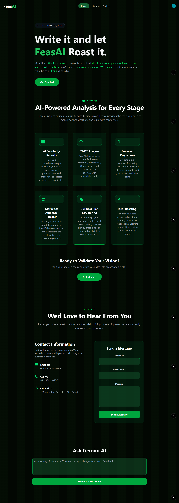
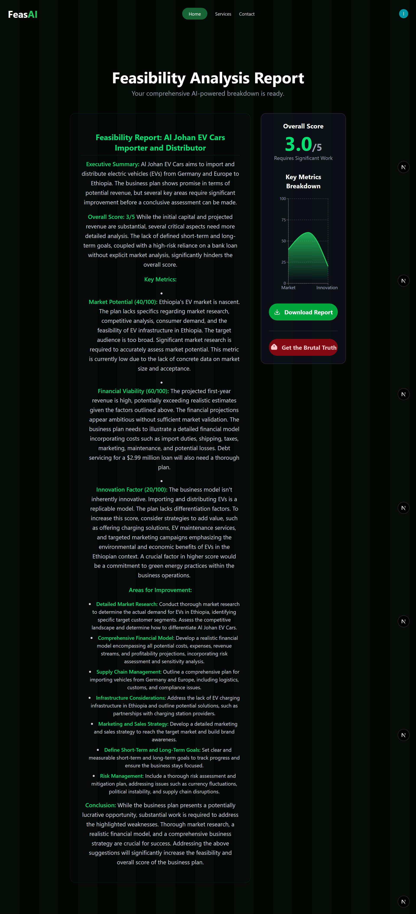

# FeasAI - AI-Powered Business Feasibility Analyst

FeasAI is a full-stack web application that leverages Google's Gemini AI to provide instant, comprehensive, and brutally honest feasibility analysis for business ideas. It guides users through a multi-step form to capture their vision and generates a detailed report with key metrics, a visual dashboard, and an unfiltered "roast" of their concept.

## Screenshots

### 1. Homepage & Hero Section
*The public-facing landing page introduces the application and prompts users to get started.*


### 2. Multi-Step Form
*Once a user starts a plan, they are guided through a series of clean, consistent forms to input their business data. All form pages are protected routes.*


### 3. AI Analysis Dashboard
*The final results page presents a detailed report, a visual breakdown of key metrics using a Recharts line chart, and an overall feasibility score.*


### 4. The "Brutal Roast"
*A unique feature where users can get a short, unfiltered, and often humorous verdict on their business idea in a pop-up modal.*


---

## Features

-   **Full Authentication System:**
    -   Secure user registration and login powered by Clerk.
    -   User data is synced to a local MongoDB database on sign-up.
-   **Protected Routes:**
    -   The entire business plan creation flow (`/businessname`, `/results`, etc.) is accessible only to authenticated users, managed by Next.js Middleware.
    -   Public routes (`/`, `/services`, `/contact`) are accessible to everyone.
-   **Multi-Step Form:**
    -   A guided process to collect Business Name, Industry, Description, Target Audience, Budget, and Goals.
    -   User progress is saved to the database at each step.
-   **AI-Powered Analysis:**
    -   A dedicated API route (`/api/generate-analysis`) fetches all user data and makes parallel calls to the Google Gemini API.
    -   Generates both a professional, detailed report and a short, "brutal roast" verdict.
-   **Dynamic Results Dashboard:**
    -   Displays the detailed report with beautiful, custom markdown styling.
    -   Visualizes key metrics (Market Potential, Financial Viability, Innovation) using a Recharts line chart.
    -   Allows users to download the full report as a markdown file.

## Tech Stack

-   **Framework:** [Next.js](https://nextjs.org/) (App Router)
-   **Language:** [TypeScript](https://www.typescriptlang.org/)
-   **Clerk Authentication:** [Clerk](https://clerk.com/)
-   **Database:** [MongoDB](https://www.mongodb.com/)
-   **ORM:** [Mongoose](https://mongoosejs.com/)
-   **Styling:** [Tailwind CSS](https://tailwindcss.com/)
-   **AI:** [Google Gemini API](https://ai.google.dev/)
-   **Charting:** [Recharts](https://recharts.org/)
-   **Deployment:** [Vercel](https://vercel.com/)

---

## Getting Started

Follow these instructions to get a copy of the project up and running on your local machine.

### Installation & Setup

1.  **Clone the repository**
    ```sh
    git clone https://github.com/Isru10/Feas_ai.git
    
    cd Feas_ai
    ```

2.  **Install dependencies**
    ```sh
    npm install
    ```

3.  **Set up environment variables**
    Create a file named `.env.local` in the root of your project. This file is ignored by Git and is the secure place for your secret keys.

    ```env
    # Get your MongoDB connection string from Atlas
    DATABASE_URL="mongodb+srv://..."

    # Get your API key from Google AI Studio
    GEMINI_API_KEY="your_gemini_api_key"

    # Get your keys from the Clerk Dashboard
    NEXT_PUBLIC_CLERK_PUBLISHABLE_KEY="pk_test_..."
    CLERK_SECRET_KEY="sk_test_..."
    ```

4.  **Run the development server**
    ```sh
    npm run dev
    ```
    Open [http://localhost:3000](http://localhost:3000) to see the application.